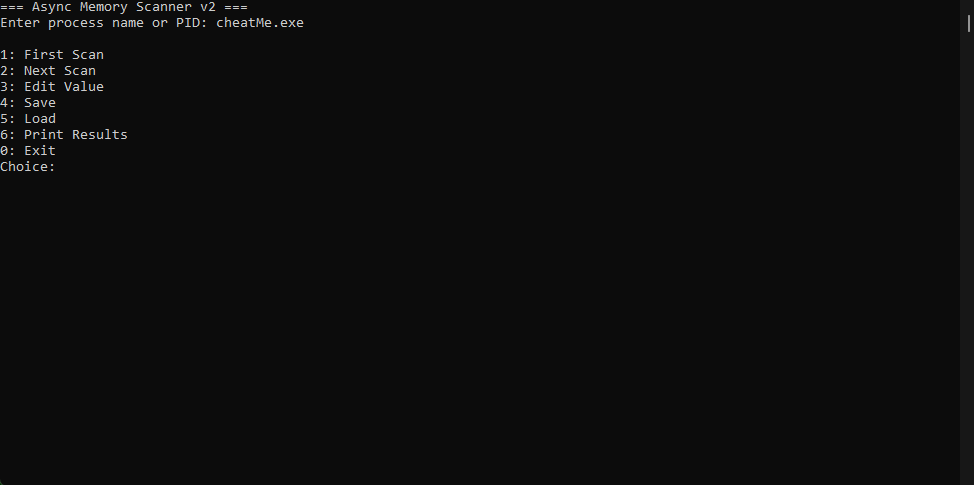

# Async Memory Scanner v2

A console-based memory scanner for Windows that allows you to search, filter, and modify integer values in another process memory

This tool works similarly to Cheat Engine basic scan/filter features but is implemented in C++ with asynchronous scanning



---

## ✨ Features
- **Attach to a process** by name or PID
- **First Scan**: Search for all memory addresses containing a given integer value
- **Next Scan**: Filter results by a new integer value (progressive narrowing)
- **Edit Values**: Change an integer value at a specific memory address
- **Save & Load**: Store scan results to a file and reload them later
- **Print Results**: Display all currently found addresses and values
- **Asynchronous Scanning**: Uses multiple threads for faster memory searching

---

## ⚙️ Requirements
- Windows (tested on Windows 11)
- MSVC / MinGW (C++17 or higher)
- Administrator privileges

---

## 🚀 Build Instructions
1. Open a terminal in the project folder
2. Compile with Visual Studio or MinGW, e.g.:
   ```bash
   g++ -std=c++17 -O2 -o dCheat.exe main.cpp -lpsapi
   ```
3. Run:
   ```bash
   dCheat.exe
   ```

---

## 🖥️ Usage
1. Start the program:
   ```bash
   dCheat.exe
   ```

2. Enter the **process name** (e.g. `cheatMe.exe`) or a **PID**

3. Use the menu:
   ```
   1: First Scan
   2: Next Scan
   3: Edit Value
   4: Save
   5: Load
   6: Print Results
   0: Exit
   ```

### Example Workflow
- Attach to `cheatMe.exe`
- Select `1: First Scan` → search for `100`
- Change the value inside cheatMe.exe, then select `2: Next Scan` → search for new value
- Repeat until only 1-3 address remains
- Select `3: Edit Value` to change the value of one of these addresses

---

## 📂 Save & Load
- Save results:
  ```
  4: Save → filename.txt
  ```
- Load results:
  ```
  5: Load → filename.txt
  ```

---

## ⚠️ Disclaimer
This tool directly reads and writes another process's memory
It is intended for **educational purposes only**
Do not use it for cheating in online games or violating software terms of service
